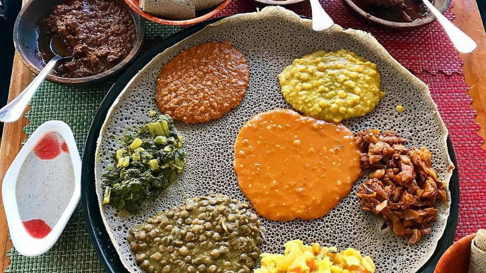
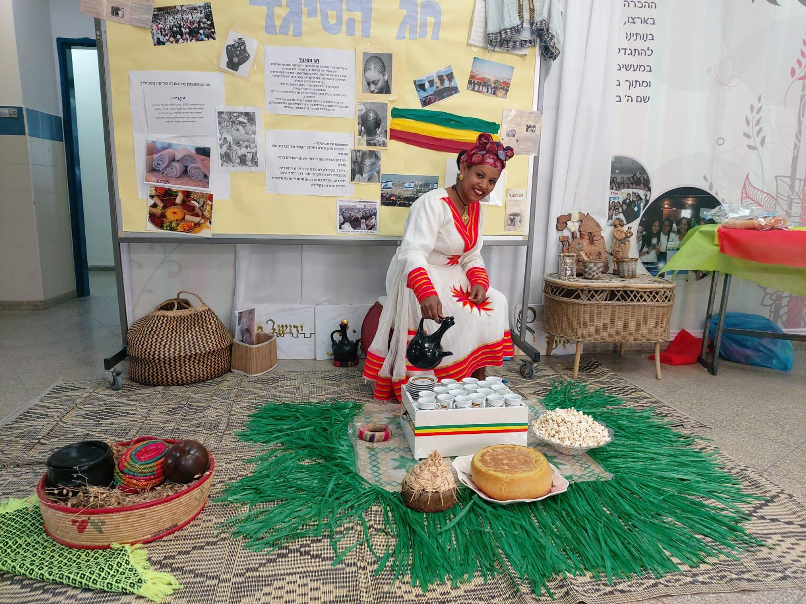

# first

 

 

# second

 

 

# third

 

 

# tree

 

 

This file was generated by Swimm. [Click here to view it in the app](https://swimm-web-app--pr-cu-866b19wkj-deloitte-make-inline-im-f25lid9j.web.app/repos/Z2l0aHViJTNBJTNBdDElM0ElM0FlcmFuLXN3aW1t/docs/vgpy30c1).
