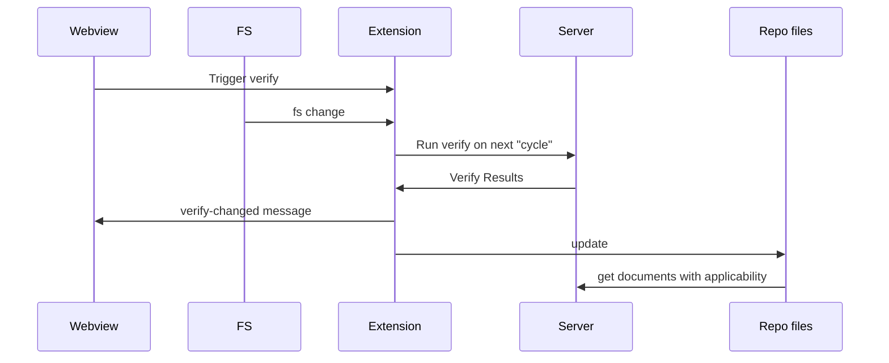

<!--MERMAID {width:100}-->

<!--MCONTENT {content: "sequenceDiagram \nparticipant Webview \nparticipant FS \nparticipant Extension \nparticipant Server \nparticipant Repo files \nWebview->>Extension: Trigger verify \nFS->>Extension: fs change \nExtension->>Server: Run verify on next \"cycle\" \nServer->>Extension: Verify Results \nExtension->>Webview: verify-changed message \nExtension->>Repo files: update \nRepo files->>Server: get documents with applicability "} --->

 

This file was generated by Swimm. [Click here to view it in the app](https://swimm-web-app.web.app/repos/Z2l0aHViJTNBJTNBdDElM0ElM0FlcmFuLXN3aW1t/docs/qgb9u).
