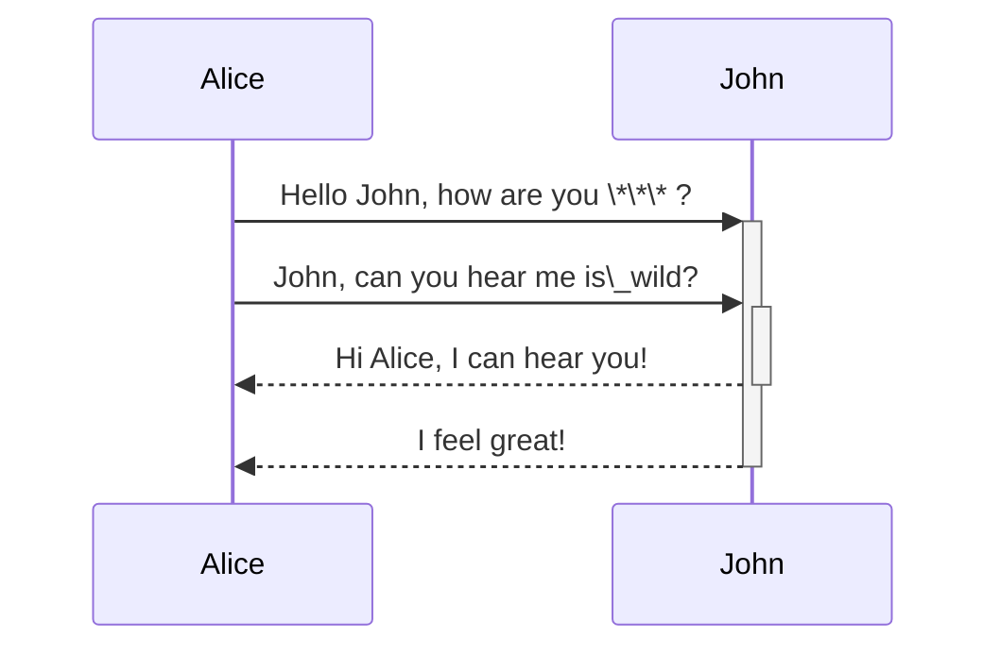

```
is_wild = true
foo = *
```

<br/>

<!--MERMAID {width:100}-->

<!--MCONTENT {content: "sequenceDiagram<br/>\nAlice->>+John: Hello John, how are you \\*\\*\\* ?<br/>\nAlice->>+John: John, can you hear me is\\_wild?<br/>\nJohn\\-\\-\\>>-Alice: Hi Alice, I can hear you!<br/>\nJohn\\-\\-\\>>-Alice: I feel great!<br/>\n\n<br/>"} --->

<br/>

This file was generated by Swimm. [Click here to view it in the app](https://swimm-web-app.web.app/repos/Z2l0aHViJTNBJTNBdDElM0ElM0FlcmFuLXN3aW1t/docs/fbow7ocf).
