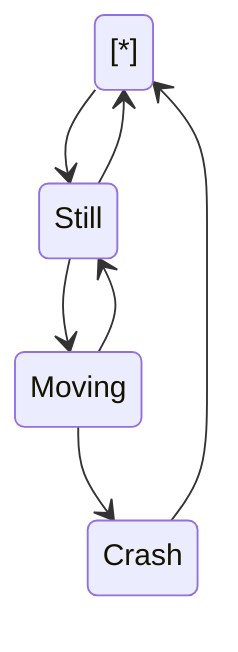

 

this is doc 123456

 

<!--MERMAID {width:100}-->

<!--MCONTENT {content: "stateDiagram-v2 \n\\[\\*\\] \\-\\-\\> Still \nStill \\-\\-\\> \\[\\*\\] \nStill \\-\\-\\> Moving \nMoving \\-\\-\\> Still \nMoving \\-\\-\\> Crash \nCrash \\-\\-\\> \\[\\*\\] "} --->

 

# header

[[sym-mention:(c7b9f3df-c205-4a45-80a1-ce84712fd725|Z27cdqh)Holly]]

[[sym-mention:(741b64c7-dfa1-4b0c-9bc0-8eb70f731935|vbL0t)eran keydar]]

 

 

`📄 new_file.py`

*   [CONTRIBUTION](https://swimm-web-app.web.app/repos/veezvxCuzpPrRLLXWD2E/docs/uiP6xeIAeR6bf0zyHtrr) - Please read this document before contributing to this repository.
    
*   [Licenses](/docs/Licenses.csv) - This document lists the licenses of the external libraries we use in production only
    
*   [setup-dev-environment](https://swimm-web-app.web.app/repos/veezvxCuzpPrRLLXWD2E/docs/ceA0GzroQRhQmjVJ3nwK) - To run swimm you will need a few things on your machine. Follow the steps below.
    
*   [suggested-addons](https://swimm-web-app.web.app/repos/veezvxCuzpPrRLLXWD2E/docs/YHcHqxichEUUFF8sYNro) - We want to share a few add-ons the dev team has found useful - these are purely suggestive.

 

 

 

 

 

 

 

 

 

This file was generated by Swimm. [Click here to view it in the app](https://swimm-web-app.web.app/repos/Z2l0aHViJTNBJTNBdDElM0ElM0FlcmFuLXN3aW1t/docs/ikd0mviy).
