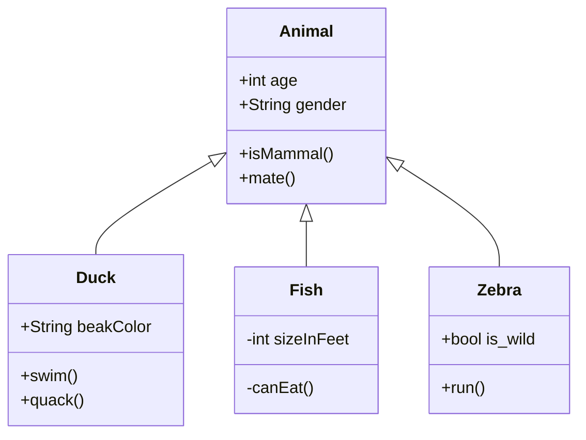

bbbb cccc dddd

fff

fff

ffff

ffffff

`📄 a.sql`

<br/>

<div align="center"></div>

<br/>

[hello](hello.0xdlb.sw.md)

[change playlist name](change-playlist-name.qllgu.pl.sw.md)

[[sym-mention:(35aec4e2-ed13-4c2b-98b7-47e590095358|ZlxTuV)eran keydar]]

<br/>

|aa|bb|
|---|---|
|cc|dd|

<br/>

<div align="center"></div>

<br/>

<!--MERMAID {width:100}-->

<!--MCONTENT {content: "classDiagram<br/>\nAnimal <|-- Duck<br/>\nAnimal <|-- Fish<br/>\nAnimal <|-- Zebra<br/>\nAnimal : +int age<br/>\nAnimal : +String gender<br/>\nAnimal: +isMammal()<br/>\nAnimal: +mate()<br/>\nclass Duck{<br/>\n+String beakColor<br/>\n+swim()<br/>\n+quack()<br/>\n}<br/>\nclass Fish{<br/>\n\\-int sizeInFeet<br/>\n\\-canEat()<br/>\n}<br/>\nclass Zebra{<br/>\n+bool is\\_wild<br/>\n+run()<br/>\n}<br/>"} --->

<br/>

<br/>

<br/>

[<--VIDEO-->](https://www.youtube.com/watch?v=VqCgcpAypFQ)

<br/>

```
def foo():
    print("hello")
```

`dict_method_1`<swm-token data-swm-token=":snip1.py:6:0:0:`dict_method_1 = dict(zip(keys_list, values_list))`"/>

<br/>

<br/>

This file was generated by Swimm. [Click here to view it in the app](//repos/Z2l0aHViJTNBJTNBdDElM0ElM0FlcmFuLXN3aW1t/docs/im10t).
