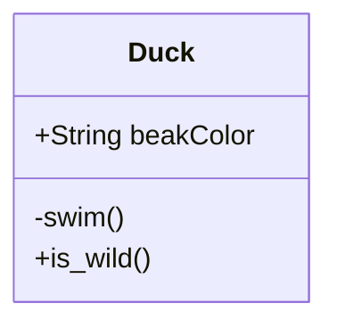

&nbsp;

# class diagram for mermaid

```mermaid
classDiagram

class Duck{

+String beakColor

-swim()

+is_wild()

}

```

<SwmMeta repo-id="Z2l0aHViJTNBJTNBdDElM0ElM0FlcmFuLXN3aW1t" repo-name="t1">Powered by [Swimm](http://localhost:5000/)</SwmMeta>
