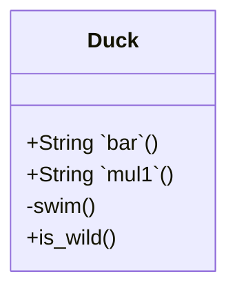

 

# class diagram for mermaid

 

<!--MERMAID {width:100}-->

<!--MCONTENT {content: "classDiagram \nclass Duck{ \n+String `bar`<swm-token data-swm-token=\":file_with_shift.c:12:2:2:`int bar() {`\"/>()\n\n+String `mul1`<swm-token data-swm-token=\":mul1.py:4:2:2:`def mul1(a, b):`\"/>() \n\\-swim() \n+is\\_wild() \n} "} --->

 

This file was generated by Swimm. [Click here to view it in the app](https://swimm-web-app.web.app/repos/Z2l0aHViJTNBJTNBdDElM0ElM0FlcmFuLXN3aW1t/docs/h9qf0).
