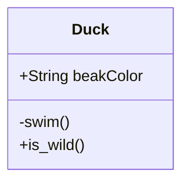

 

# class diagram for mermaid

 

<!--MERMAID {width:100}-->

<!--MCONTENT {content: "classDiagram \nclass Duck{ \n+String beakColor \n\\-swim() \n+is\\_wild() \n} "} --->

 

This file was generated by Swimm. [Click here to view it in the app](https://swimm-web-app.web.app/repos/Z2l0aHViJTNBJTNBdDElM0ElM0FlcmFuLXN3aW1t/docs/h9qf0).
