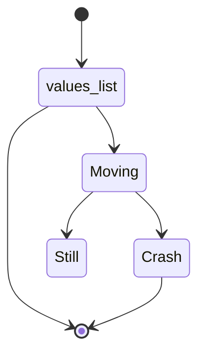

<!--MERMAID {width:100}-->

<!--MCONTENT {content: stateDiagram-v2  
\[\*\] \-\-\> `values_list`[<sup id="veHAP">↓</sup>](#f-veHAP)  
`values_list`[<sup id="veHAP">↓</sup>](#f-veHAP) \-\-\> \[\*\]  
`values_list`[<sup id="veHAP">↓</sup>](#f-veHAP) \-\-\> Moving  
Moving \-\-\> Still  
Moving \-\-\> Crash  
Crash \-\-\> \[\*\]} --->

<br/>

<!-- THIS IS AN AUTOGENERATED SECTION. DO NOT EDIT THIS SECTION DIRECTLY -->
### Swimm Note

<span id="f-veHAP">values_list</span>[^](#veHAP) - "snip1.py" L2
```python
values_list = ['blue', 'red', 'bold']
```

<br/>

This file was generated by Swimm. [Click here to view it in the app](https://swimm-web-app.web.app/repos/Z2l0aHViJTNBJTNBdDElM0ElM0FlcmFuLXN3aW1t/docs/8yni0).